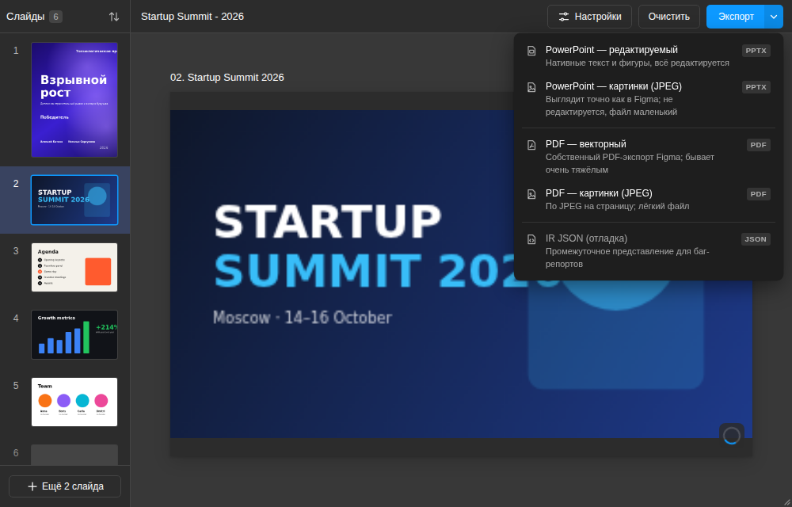
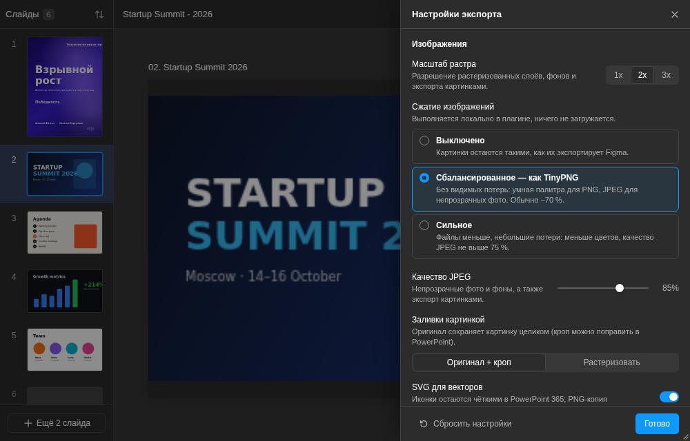
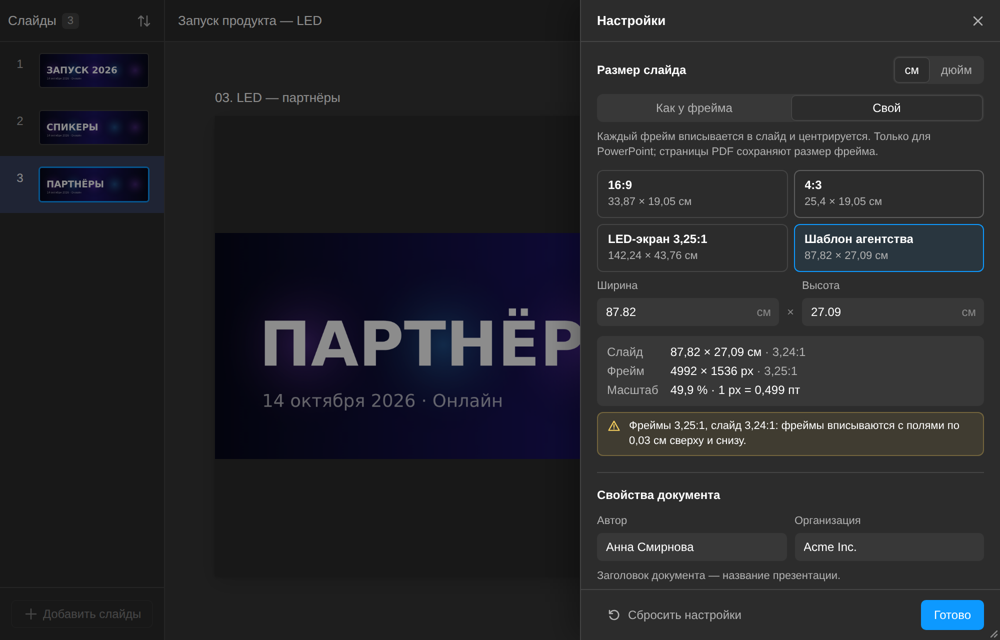

# FigmaDeck — экспорт фреймов Figma в редактируемый PPTX

FigmaDeck — плагин для Figma, который превращает выбранные фреймы в презентацию PowerPoint: каждый фрейм —
слайд, текст остаётся редактируемым текстом PowerPoint, простые фигуры становятся нативными фигурами,
группы — группами, а всё, что нельзя передать без потери вида, аккуратно растеризуется (с отчётом, что и почему).
Четыре варианта экспорта: **PowerPoint — редактируемый**, **PowerPoint — картинки (JPEG)**, **PDF — векторный** и
**PDF — картинки (JPEG)**; плюс отладочный дамп IR JSON. Размер слайда — как у фрейма (с автоподгонкой под лимит
PowerPoint 56″) или свой, например под шаблон агентства 87,82 × 27,09 см.

Всё работает локально: плагин не ходит в сеть (`networkAccess.allowedDomains: ["none"]`), без сервера,
аналитики и CDN.

## Содержание

- [Чем FigmaDeck лучше Deck](#чем-figmadeck-лучше-deck)
- [Сборка и установка в Figma](#сборка-и-установка-в-figma)
- [Как пользоваться](#как-пользоваться)
- [Четыре варианта экспорта](#четыре-варианта-экспорта)
- [Настройки](#настройки)
- [Сжатие картинок (как TinyPNG)](#сжатие-картинок-как-tinypng)
- [Размер слайда и шаблон агентства](#размер-слайда-и-шаблон-агентства)
- [Шрифты: соответствие и правило RIBBI](#шрифты-соответствие-и-правило-ribbi)
- [Отчёт после экспорта](#отчёт-после-экспорта)
- [Очень большие фреймы и лимит PowerPoint 56″](#очень-большие-фреймы-и-лимит-powerpoint-56)
- [PowerPoint не открывает PPTX из Deck — что делать](#powerpoint-не-открывает-pptx-из-deck--что-делать)
- [Ограничения и приближения](#ограничения-и-приближения)
- [Export IR JSON и фикстуры](#export-ir-json-и-фикстуры)
- [Разработка](#разработка)
- [Приватность](#приватность)

## Чем FigmaDeck лучше Deck

Ориентир — плагин [Deck](https://deck.is) (код закрытый, ничего не копировалось). Сравнение основано на разборе
его выходных PPTX (`docs/reference-analysis.md`).

| | Deck | FigmaDeck |
|---|---|---|
| Растр | 1x (2x — опция), PNG как есть | **2x по умолчанию**, 1x / 2x / 3x; **сжатие картинок как TinyPNG** (палитра до 256 цветов без видимых потерь, JPEG для непрозрачных фото): PNG из Deck-макета −72 % |
| Язык текста | `lang="en-US"` для всего, PowerPoint подчёркивает русский текст | **по каждому run'у**: кириллица → `ru-RU`, иначе `en-US` (плюс el, he, ar, ja, ko, zh) |
| Шрифты | полное имя начертания всегда («SB Sans Text Regular», «… Bold») | **RIBBI**: Regular / Bold / Italic / Bold Italic → имя семейства + `b`/`i`; остальные начертания → «Семейство Начертание»; ручное переопределение в UI |
| Фигуры | нативна только подложка фрейма, остальное — картинки | **нативные** `rect` / `roundRect` / `ellipse` / `line` (толщина, цвет, пунктир, концы, стрелки), линейные градиенты, одна тень, поворот, отражение |
| Группы | нет, иерархия сплющена | **`<p:grpSp>`** для групп и фреймов без маски и эффектов |
| Прозрачность | не переносится (`alpha=100000`) | **opacity слоя и заливок** → alpha заливки, линии, текста, картинки |
| Отчёт | нет | **что растеризовано и почему**, что пропущено, какие шрифты нужны получателю |
| Метаданные | `PptxGenJS` в авторе / заголовке | **свои**: название презентации, автор, организация, приложение FigmaDeck |
| Фрейм шире / выше 4032 px | файл > 56″, PowerPoint его **не открывает** | **автомасштаб** в пределы 1″…56″ вместе со шрифтами, интервалами, обводками и тенями; или **свой размер слайда** (шаблон агентства, 16:9…) |
| Векторный PDF | — | одинаковые картинки и шрифты из разных фреймов **хранятся один раз** |
| Клиппинг (`clipsContent`) | содержимое прокручиваемых списков лежит за пределами слайда (260 из 311 текстбоксов в разобранном файле), сотни пустых 1×1 PNG | слои вне клипа **не экспортируются**, частично обрезанные картинки кропаются, остальное растеризуется вместе с клипом |
| Абзацы | несколько `<a:pPr>` в одном `<a:p>` (невалидно по схеме) | собственный генератор `<p:txBody>`: **ровно один `<a:pPr>` на абзац**, `cap="all"`, списки, ссылки, sup/sub |
| Мелкие векторы | по картинке на каждый слой 8×8 | группа иконки — **одна картинка** (SVG + PNG) |
| Картинки-заливки | растр слоя | **оригинальные байты + кроп** (`srcRect`), при желании перекадрируется в PowerPoint |

## Сборка и установка в Figma

Нужны Node.js 22 и **десктопное приложение Figma** (плагины в разработке импортируются только в нём).

```bash
npm ci
npm run build        # → dist/code.js и dist/ui.html (весь UI инлайнится в один HTML)
```

1. Figma → меню → **Plugins → Development → Import plugin from manifest…**
2. Выберите `manifest.json` из корня репозитория. Папка `dist/` должна быть собрана — манифест ссылается на
   `dist/code.js` и `dist/ui.html`.
3. Запуск: **Plugins → Development → FigmaDeck — Export to PPTX**.

После изменений в коде — снова `npm run build` (или `npm run dev` — пересборка при сохранении) и перезапуск
плагина. Плагин работает с `documentAccess: "dynamic-page"`, т. е. и в больших многостраничных файлах.

## Как пользоваться

1. **Добавьте слайды.** Выделите фреймы на холсте и нажмите **«Добавить слайды»**. Секция добавляет свои
   фреймы верхнего уровня; выделенный слой внутри фрейма добавляет весь фрейм. Список слайдов сохраняется в самом
   Figma-файле — при следующем запуске он на месте.
2. **Порядок.** По умолчанию — по положению на холсте: страницы по порядку, затем ряды (по y, с допуском
   половины высоты), затем по x. Слева — миниатюры: перетаскивайте, удаляйте, кнопка «Упорядочить по положению
   на холсте» возвращает автоматический порядок. Двойной клик — показать фрейм на холсте. Фрейм, который удалили
   в Figma, показывается серым и пропускается при экспорте.
3. **Название** презентации — вверху (клик, чтобы переименовать); оно же имя файла и заголовок документа.
4. **Настройки** — кнопка «Настройки» (см. ниже). Сохраняются для пользователя, а не для файла.
5. **Экспорт.** Кнопка «Экспорт» делает «PowerPoint — редактируемый»; стрелка рядом открывает меню с четырьмя
   вариантами экспорта и отладочным IR JSON (см. ниже). Идёт прогресс (слайд, число пройденных слоёв,
   «растеризация N из M») с кнопкой «Отменить»; Figma при этом не зависает (картинки экспортируются батчами,
   между слоями — `await`).
6. **Отчёт** открывается после экспорта; файл скачивается автоматически («Скачать ещё раз» — в отчёте).

## Четыре варианта экспорта



| Вариант (меню «Экспорт») | Файл | Что получается | Когда выбирать |
|---|---|---|---|
| **PowerPoint — редактируемый** | `.pptx` | нативные текст и фигуры, картинки, группы; остальное растеризуется послойно. Режим «Редактируемый» / «Точный вид» — в настройках | презентацию будут править |
| **PowerPoint — картинки (JPEG)** | `.pptx` | каждый слайд — одна картинка: выглядит точно как в Figma, ничего не редактируется, файл маленький | показ «как есть» (LED-экран, мероприятие), править не нужно |
| **PDF — векторный** | `.pdf` | собственный PDF-экспорт Figma по каждому фрейму (`exportAsync PDF`), склеенный в один файл; текст выделяется, всё масштабируется без потерь. **Бывает очень тяжёлым** | печать, когда нужен вектор |
| **PDF — картинки (JPEG)** | `.pdf` | по одной JPEG-картинке на страницу — лёгкий файл | отправить почтой / в мессенджер |
| IR JSON (отладка) | `.figmadeck.json` | промежуточное представление — для баг-репортов и тестов | см. [ниже](#export-ir-json-и-фикстуры) |

Кнопка «Экспорт» без стрелки — это «PowerPoint — редактируемый».

### PowerPoint — редактируемый: режимы

Настройки → раздел «PowerPoint — редактируемый»:

- **Редактируемый** (по умолчанию) — нативные текст, фигуры, картинки и группы; остальное растеризуется
  послойно (таблица соответствий — `docs/ARCHITECTURE.md`).
- **Точный вид** — всё, кроме текста, одна фоновая картинка слайда; поверх — редактируемые текстбоксы.
  Хорош, когда дизайн сложный (эффекты, маски), а править нужно только текст.

Прежний режим «Только картинка» стал отдельным вариантом «PowerPoint — картинки (JPEG)»; если он остался в
сохранённых настройках, редактируемый PowerPoint считает его режимом «Редактируемый».

### Экспорт картинками (PowerPoint и PDF — JPEG)

- Каждый фрейм экспортируется из Figma целиком одной картинкой в «Масштабе растра» (по умолчанию 2x: фрейм
  4992×1536 → 9984×3072 px) и пересохраняется в JPEG с «Качеством JPEG» из настроек (по умолчанию 85 %;
  при «Сильном» сжатии — не выше 75 %). Если у фрейма прозрачный фон, JPEG невозможен — картинка сжимается как
  PNG (палитра или без потерь, см. [Сжатие картинок](#сжатие-картинок-как-tinypng)). «Сжатие изображений:
  Выключено» здесь работает как «Сбалансированное» — эти варианты по определению JPEG.
- PowerPoint: размер слайда — по настройке «[Размер слайда](#размер-слайда-и-шаблон-агентства)».
- PDF: размер страницы = размер фрейма, 1 px = 1 pt (фрейм 4992×1536 → страница 4992 × 1536 pt = 69,33″ × 21,33″).
  Сторона больше 14 400 pt (200″ — предел, который принимают PDF-просмотрщики, Acrobat больше не открывает)
  уменьшается вместе с другой стороной пропорционально; в отчёте — заметка «Страница уменьшена…».

### PDF — векторный: почему тяжёлый и что с этим делает плагин

Figma экспортирует каждый фрейм отдельным PDF и в каждый заново встраивает все ресурсы: фоновое фото, логотипы,
шрифты, ICC-профили. Если одна и та же картинка стоит на 30 слайдах, в склеенном PDF было бы 30 её копий.

FigmaDeck после склейки (pdf-lib) оставляет **по одной копии каждого одинакового объекта**: потоки (картинки,
маски, файлы шрифтов, ICC-профили, одинаковое содержимое страниц) сравниваются по хешу содержимого и словарю, а
затем побайтно; все ссылки на копии перенаправляются на оставшийся объект, копии удаляются. Проход повторяется,
пока находятся совпадения: после слияния масок совпадают картинки, которые на них ссылаются, после слияния файлов
шрифтов — их описания и т. д. Файл сохраняется с объектными потоками (object streams). Страницы, их порядок и
размеры не меняются. В отчёте — строка «Повторы картинок и шрифтов сохранены один раз: объектов — N, экономия X».

Разные подмножества одного шрифта (Figma встраивает в каждый фрейм только его глифы) совпадают редко — их
объединить нельзя. Если PDF всё равно слишком тяжёлый, используйте «PDF — картинки (JPEG)».

## Настройки

| Настройка | По умолчанию | Что делает |
|---|---|---|
| PowerPoint — редактируемый | Редактируемый | режим: «Редактируемый» или «Точный вид» (см. выше) |
| Масштаб растра | 2x | разрешение растеризованных слоёв, фонов и экспорта картинками: 1x / 2x / 3x. Очень большие экспорты автоматически ограничиваются 8192 px по стороне |
| Сжатие изображений | Сбалансированное — как TinyPNG | «Выключено» / «Сбалансированное» / «Сильное»: см. [раздел ниже](#сжатие-картинок-как-tinypng) |
| Качество JPEG | 0,85 | 0,5…1; для непрозрачных фото, фонов и экспорта картинками («Сильное» ограничивает его 0,75); при «Выключено» неактивно |
| Заливки картинкой | Оригинал + кроп | «Оригинал» — исходная картинка целиком с кропом (можно перекадрировать в PowerPoint; лишнее разрешение уменьшается); «Растеризовать» — экспорт слоя как есть |
| SVG для векторов | вкл. | иконки пишутся как SVG (чёткие в PowerPoint 365) + PNG-копия для остальных программ |
| ВЕРХНИЙ регистр | Атрибут «Все прописные» | `textCase: UPPER` → `cap="all"` (текст остаётся как набран) или «Менять текст» — строка переводится в прописные |
| Запас ширины | 3 % | дополнительная ширина текстбоксов с автошириной (WIDTH_AND_HEIGHT), чтобы PowerPoint не переносил последнее слово; 0…10 % |
| Частично обрезанный текст | Растеризовать | текст, который фрейм с `clipsContent` режет наполовину: растеризовать вместе с клипом или оставить текстом (будет вылезать) |
| Сохранять группы | вкл. | группы и фреймы Figma → группы PowerPoint; выкл. — всё плоско |
| Нативные градиенты | вкл. | линейные градиенты пишутся как `<a:gradFill>` (редактируемые); выкл. — растеризуются. Радиальные / угловые / ромбовидные растеризуются всегда |
| Размер слайда | Как у фрейма | только PowerPoint. «Как у фрейма» — 1 px = 1 pt по первому слайду, с автомасштабом в 1″…56″; «Свой» — ширина × высота в см или дюймах, шаблоны 16:9, 4:3, LED-экран 3,25:1, шаблон агентства; см. [раздел ниже](#размер-слайда-и-шаблон-агентства) |
| Автор, Организация | FigmaDeck, пусто | свойства документа (`docProps`); заголовок = название презентации |
| Имена шрифтов в PowerPoint | RIBBI (стандарт Windows) | или «Полные имена начертаний», см. ниже |
| Соответствие шрифтов | авто | ручное переопределение для каждой пары «семейство + начертание» Figma |

Все эвристики и калибровочные константы (коэффициент AUTO line-height 1,2, запас ширины, допуск рядов, пороги
растеризации…) собраны в `src/config.ts`.

## Сжатие картинок (как TinyPNG)



Figma отдаёт растеризованные слои, фоны и иконки полноцветными PNG — именно они делают PPTX тяжёлым. Перед сборкой
файла FigmaDeck сжимает каждую растровую картинку (заливки-картинки, фоны, растеризованные слои, PNG-копии
векторов; SVG и GIF не трогаются) так же, как это делают TinyPNG и pngquant: палитра до 256 цветов с адаптивным
дизерингом, но только если результат проходит проверку качества.

**Всё локально.** Картинки никуда не загружаются (TinyPNG — это сервис, FigmaDeck его не использует): сжатие
идёт внутри окна плагина, в фоновом потоке (Web Worker), код которого встроен в тот же `dist/ui.html`.

| Уровень | Что делает |
|---|---|
| **Выключено** | картинки остаются ровно такими, как их экспортировала Figma. Уменьшаются только слишком большие заливки-картинки (PNG пересохраняется без потерь, JPEG — с качеством 92 %) |
| **Сбалансированное — как TinyPNG** (по умолчанию) | без видимых потерь. Для каждой картинки пробуются варианты и берётся самый маленький: (а) ≤ 256 цветов — **точная палитра** (без потерь); (б) непрозрачное фото / фон / растр — **JPEG** с «Качеством JPEG»; (в) **палитра до 256 цветов** с дизерингом за «воротами качества»: PSNR ≥ 40 дБ, SSIM ≥ 0,98, полосатость (banding) градиентов ≤ 1,1; (г) **PNG без потерь** (лучшие фильтры, без метаданных) |
| **Сильное** | файлы меньше, небольшие потери: JPEG не выше 75 %, ворота мягче (PSNR ≥ 38 дБ, SSIM ≥ 0,97, полосатость ≤ 1,5), дополнительно пробуются палитры на 128 и 64 цвета |

Правила выбора:

- JPEG — никогда для картинок с прозрачностью и для PNG-копий векторов (иконки остаются PNG); JPEG выигрывает у
  PNG, только если он хотя бы на 10 % меньше (PNG держит края и мелкий текст чётче).
- Результат никогда не бывает больше исходника: если ничего не получилось меньше — остаются байты из Figma.
- JPEG-оригиналы (фото в заливках) пересжимаются, только если их уменьшают, — иначе это лишняя потеря качества.
- Непрозрачная картинка, в которой больше 4096 цветов (фото, плавные градиенты), палитру не пробует: на макетах
  Deck и синтетических слайдах JPEG там был в 3–40 раз меньше, а поиск палитры стоит ~1–2 с на мегапиксель.
- Экспорт картинками (PowerPoint / PDF — картинки): непрозрачный слайд сразу уходит в JPEG; прозрачный фрейм
  сжимается как PNG.

**Сколько экономит.** На наборе PNG из PPTX, который выдал Deck для реального макета (карточки с градиентами,
иконки, 1168×874 px и меньше): «Сбалансированное» −71,8 % (4016 → 1134 КБ), «Сильное» −76,1 %; pngquant
(движок TinyPNG) на тех же файлах — −71,0 %, при этом полосатость градиентов у FigmaDeck ниже (0,4–0,75 против
0,55–1,05). Огромные плавные градиенты (LED-фрейм 9984×3072) почти не сжимаются палитрой без видимых полос: там
«Сбалансированное» оставляет PNG без потерь (−8,5 %), «Сильное» даёт −21,6 %. Цифры и кропы для сравнения —
`npm run compress:bench` (`scripts/compress-bench.ts`).

**Скорость.** Палитра — примерно 0,7–2 с на мегапиксель (картинка 1168×874 — 1–2 с), без потерь —
0,5–1 с на мегапиксель; картинка 30 Мп заняла бы 12–30 с и несколько сотен МБ памяти, поэтому картинки больше
25 Мп получают только точную палитру или JPEG. Окно плагина при этом не зависает: сжатие идёт в фоновом потоке,
прогресс показывает «Сжатие изображений 3 из 12» и размер текущей картинки, «Отменить» останавливает поток
сразу. Если окружение запрещает фоновые потоки (строгая CSP), сжатие выполняется в основном потоке между
картинками — окно может ненадолго подвисать, об этом говорят прогресс и отчёт.

В отчёте после экспорта — строка вида «Картинки: 12 · 12,4 МБ → 3,1 МБ (−75 %) · палитра: 3, точная палитра: 2,
JPEG: 4, без потерь: 2, без изменений: 1». Настройки порогов — `CONFIG.compress` и `CONFIG.ui.image*` в
`src/config.ts`.

## Размер слайда и шаблон агентства



Настройки → «Размер слайда». Действует на оба варианта PowerPoint; страницы PDF всегда в размере фрейма.

- **Как у фрейма** (по умолчанию) — размер первого слайда, 1 px = 1 pt, с автоматическим уменьшением до лимита
  PowerPoint 56″ (см. [ниже](#очень-большие-фреймы-и-лимит-powerpoint-56)). Фрейм 4992×1536 → слайд
  56 × 17,23″ (142,24 × 43,77 см), масштаб 80,8 %.
- **Свой** — ширина и высота в сантиметрах или дюймах (переключатель «см / дюйм» справа от заголовка раздела; для
  русского интерфейса по умолчанию сантиметры; в настройках хранится в дюймах, 1…56″ по стороне) и шаблоны:

| Шаблон | Размер | Пропорции |
|---|---|---|
| 16:9 | 13,333 × 7,5″ (33,87 × 19,05 см) — стандартный широкоформатный слайд PowerPoint | 16:9 |
| 4:3 | 10 × 7,5″ (25,4 × 19,05 см) | 4:3 |
| LED-экран 3,25:1 | 56 × 17,23″ (142,24 × 43,76 см) — максимум PowerPoint для кадров 4992×1536 | 3,25:1 |
| Шаблон агентства | 87,82 × 27,09 см (34,575 × 10,665″) | ≈ 3,24:1 |

Каждый фрейм вписывается в слайд равномерно (по меньшему из двух коэффициентов) и центрируется; поля по краям
заливаются фоном слайда. Под полями ввода плагин показывает итог: размер и пропорции слайда, размер и пропорции
первого фрейма, масштаб (1 px = … pt). Если пропорции фрейма и слайда отличаются больше чем на 0,1 %, появляется
предупреждение с шириной полей; если в презентации фреймы разных пропорций — сколько из них получат поля.

**Пример: шаблон агентства и фреймы 4992×1536.** Слайд шаблона — 87,82 × 27,09 см (пропорции ≈ 3,24:1), фреймы —
3,25:1. «Размер слайда → Свой → Шаблон агентства»: в PPTX записывается `sldSz` ровно 31 615 200 × 9 752 400 EMU,
как в шаблоне; фрейм уменьшается до 49,9 % (заголовок 64 px → 31,9 pt), сверху и снизу остаются поля по 0,03 см —
о них и говорит предупреждение в настройках. Слайды такого PPTX вставляются в презентацию на шаблоне агентства
без «Изменить размер слайда». Для проверки без Figma: `npm run fixture:pptx -- <ir.json> out.pptx --slide-size=34.574803x10.665354` (дюймы с точностью, дающей те же EMU).

## Шрифты: соответствие и правило RIBBI

Windows объединяет под одним именем семейства не больше четырёх начертаний — **R**egular, **I**talic,
**B**old, **B**old **I**talic (RIBBI). Все остальные (Light, Medium, Semibold, Black, Condensed…) — это
отдельные «семейства» с именем «Семейство Начертание». PowerPoint ищет шрифт именно так, поэтому FigmaDeck пишет:

| Figma | В PPTX |
|---|---|
| Inter / Regular | `Inter` |
| Inter / Bold Italic | `Inter` + полужирный + курсив |
| SB Sans Display / Semibold | `SB Sans Display Semibold` |
| SB Sans Display / Semibold Italic | `SB Sans Display Semibold` + курсив |
| Roboto / Condensed Bold | `Roboto Condensed` + полужирный |

- **Имена шрифтов в PowerPoint** (Настройки → «Шрифты», одна настройка на всю презентацию):
  - **RIBBI (стандарт Windows)** — по умолчанию, как в таблице выше;
  - **Полные имена начертаний** — каждое не-Regular начертание отдельным семейством: «Семейство Bold» без
    атрибута «полужирный» (курсив остаётся атрибутом). Нужен, когда у получателя шрифты установлены «по семейству
    на вес» — так бывает в шаблонах агентств и в файлах Deck.

  | Figma | RIBBI | Полные имена |
  |---|---|---|
  | Inter / Regular | `Inter` | `Inter` |
  | Inter / Bold | `Inter` + полужирный | `Inter Bold` |
  | Inter / Bold Italic | `Inter` + полужирный + курсив | `Inter Bold` + курсив |
  | SB Sans Display / Semibold | `SB Sans Display Semibold` | `SB Sans Display Semibold` |

  Под переключателем — пример на шрифте из вашей презентации; таблица соответствия ниже заполняется
  автоматическими именами по выбранному правилу.
- **Соответствие шрифтов** в настройках: список всех шрифтов презентации (сколько раз используется, помечены
  отсутствующие в Figma); для каждой строки можно вписать своё имя шрифта PowerPoint и атрибуты «полужирный» /
  «курсив». Переопределённые строки помечены «вручную»; «Сбросить» возвращает автоматическое соответствие.
- «Book» и «Roman» по умолчанию — отдельные семейства (`Futura PT Book`); меняется в `CONFIG.fonts`.
- **Шрифты не встраиваются.** Они должны быть установлены у каждого, кто открывает файл, иначе PowerPoint
  подставит другой шрифт и вёрстка поплывёт. Встраивание (этап 4) исследовано и есть экспериментальный прототип,
  но в UI он не подключён: Figma не даёт плагину доступа к файлам шрифтов, Keynote и Google Slides встроенные
  шрифты всё равно игнорируют, а совместимость с PowerPoint ещё надо проверить вручную. Подробности —
  `docs/font-embedding.md`.

## Отчёт после экспорта

- Сводка: вариант экспорта, слайды, размер файла, время, количество текстбоксов / фигур / картинок / групп;
  сжатие картинок — сколько их было, общий размер до и после, чем сжата каждая (палитра, точная палитра, JPEG,
  без потерь, без изменений; см. [Сжатие картинок](#сжатие-картинок-как-tinypng)); для векторного PDF — сколько
  повторяющихся объектов сохранено один раз и сколько это сэкономило.
- **Шрифты**: какой шрифт Figma как записан в PPTX (с атрибутами, пометкой «вручную») и предупреждение, что их
  нужно установить у получателя.
- **Растеризованные слои** по слайдам — с причинами: градиент (не линейный), маска, blend mode, blur, несколько
  заливок, разные радиусы, обводка (по сторонам, градиентная), трансформация (skew), клиппинг, групповая
  прозрачность, неподдерживаемый тип слоя или заливки (видео, паттерн, шум), настройка экспорта (например,
  «Заливки картинкой → Растеризовать»), особенности текста, вектор / булева операция… (для векторного PDF раздела
  нет — его рисует Figma).
- **Пропущенные слои** — вне слайда или своего клипа.
- **Предупреждения**: фрейм удалён и пропущен (в том числе для векторного PDF), шрифт отсутствует в Figma, текст
  с многоточием (TRUNCATE) экспортирован целиком, слайд другого размера вписан в размер первого, группа не
  сохранилась и т. п. **Заметки**: слайд масштабирован под лимит 56″ или под свой размер слайда, страница PDF
  картинками уменьшена до 200″.
- «Скопировать отчёт» — текстовая версия в буфер обмена (удобно прикладывать к баг-репорту).

## Очень большие фреймы и лимит PowerPoint 56″

PowerPoint принимает слайды со стороной от 1″ до 56″. При 1 px = 1 pt это 72…4032 px. Фрейм 4992×1536
(«5K wide») дал бы слайд 69,33″ — такой файл PowerPoint не откроет вовсе.

FigmaDeck считает для презентации один коэффициент `s = min(1, 4032 / большая сторона)` (и `≥ 72 / меньшая
сторона` для крошечных фреймов), записывает корректный `sldSz` и масштабирует всё: позиции, размеры, кегль,
межбуквенные и межстрочные интервалы, обводки, радиусы, тени. Заголовок 64 px на фрейме 4992 px станет 51,7 pt
на слайде 56″ — пропорции сохраняются. Растр остаётся той же плотности относительно фрейма. В отчёте появится
запись «Слайд масштабирован».

Размер слайда в презентации один. Его задаёт первый слайд; слайды другого размера вписываются в него равномерно
и центрируются (тоже с записью в отчёте). Чтобы задать размер явно (например, шаблон агентства), выберите
«Размер слайда → Свой» ([подробнее](#размер-слайда-и-шаблон-агентства)).

## PowerPoint не открывает PPTX из Deck — что делать

Если PPTX сделан Deck (или любым экспортом «1 px = 1 pt») из фрейма шире или выше 4032 px, у него
`<p:sldSz>` больше 56″ и PowerPoint отказывается его открывать — чинить «repair» тоже не умеет. Варианты:

1. **Переэкспортировать фрейм через FigmaDeck** — масштаб подберётся автоматически (лучший вариант: текст
   и фигуры станут редактируемыми).
2. **Починить имеющийся файл скриптом** (нужен только Node.js и `npm ci` в этом репозитории):

   ```bash
   npm run fix-oversized -- "Презентация.pptx"            # → Презентация_fixed.pptx
   npm run fix-oversized -- input.pptx output.pptx
   ```

   Скрипт уменьшает `sldSz` до 56″ по большей стороне и равномерно масштабирует все слайды, макеты и мастера:
   позиции, размеры, кегль, интервалы, отступы, толщину линий, тени. XML правится как текст (атрибуты), поэтому
   остальная разметка не меняется. Проверено на синтетическом файле 69,33″×21,33″ → 56″×17,23″.
3. LibreOffice Impress такой файл открывает (проверено на 24.2), но при сохранении обратно в PPTX размер
   не исправляет — для PowerPoint всё равно нужен пункт 1 или 2. Keynote и Google Slides не проверялись.

## Ограничения и приближения

- **Метрики текста.** PowerPoint и Figma по-разному верстают строки. Компенсируется запасом ширины (3 %),
  `wrap="none"` для однострочных текстов, абсолютным межстрочным интервалом (`spcPts`); `lineHeight: AUTO`
  приближается как кегль × 1,2. Точность — 1–2 px на тестовых макетах, но не пиксель в пиксель. OpenType-фичи
  (кроме верхнего / нижнего индекса), текст по контуру, leading trim не переносятся; текст с многоточием
  (TRUNCATE) экспортируется целиком.
- **Auto layout** не переносится: всё позиционируется абсолютно.
- **Эффекты**: нативно — одна тень (внешняя или внутренняя) без spread. Blur, несколько теней, spread,
  маски, blend mode, радиальные / угловые / ромбовидные градиенты, градиентные обводки, обводки по сторонам,
  разные радиусы углов, skew, булевы операции → растр (с записью в отчёте).
- **Групповая прозрачность**: в PowerPoint у групп нет opacity, она запекается в каждый элемент; если дети
  перекрываются (результат выглядел бы иначе) — группа растеризуется.
- **Обводки inside / outside** эмулируются изменением геометрии; полупрозрачная обводка с заливкой пишется двумя
  фигурами.
- **Векторы и иконки** — картинки (SVG + PNG). SVG показывает PowerPoint 365, остальные — PNG-копию (в выбранном
  масштабе растра).
- **Картинки-заливки**: FILL / FIT / CROP без поворота — оригинал + кроп; TILE, поворот, фильтры → растр.
- **Компоненты и инстансы** экспортируются как обычные группы (без связи с мастером); заметки докладчика не
  переносятся.
- **Размер слайда** один на презентацию (слайды другого размера вписываются, с полями по краям).
- **Экспорт картинками** не редактируется и не содержит текста для поиска; **векторный PDF** — это то, что
  экспортирует сама Figma (плагин только склеивает страницы и убирает повторы ресурсов).
- **Шрифты не встраиваются** (см. выше).
- LibreOffice, Keynote и Google Slides показывают PPTX по-своему; основная цель — PowerPoint. Что проверять
  руками в каждом — `docs/MANUAL-CHECKS.md`.

## Export IR JSON и фикстуры

**Экспорт → IR JSON (отладка)** сохраняет `<название>.figmadeck.json`: всё, что плагин извлёк из фреймов
(текст по run'ам, геометрия, заливки, картинки в base64, отчёт), до сборки PPTX. По этому файлу можно
воспроизвести сборку без Figma:

```bash
npm run fixture:pptx -- "Презентация.figmadeck.json" out.pptx
npm run fixture:pptx -- "Презентация.figmadeck.json" out.pptx --slide-size=34.574803x10.665354 --font-naming=full
```

Чтобы прислать макет как фикстуру для тестов, приложите этот файл к задаче (и, по возможности, PNG тех же
фреймов из Figma — для визуальной регрессии). Учтите: внутри весь текст и исходные картинки фреймов; если макет
конфиденциальный, замените фото и тексты заглушками. Как фикстура попадает в тесты — `docs/TESTING.md`.

## Разработка

```
manifest.json          манифест Figma (dynamic-page, без сети)
scripts/               сборка (esbuild) и скрипты `npm run fixtures | fixture:pptx | visual |
                       ui:screenshots | fix-oversized`
src/config.ts          все эвристики и константы
src/ir/                типы IR и (де)сериализация
src/shared/            настройки, протокол сообщений main ⇄ UI, определение языка
src/fonts/             mapping.ts (RIBBI), embed.ts (этап 4, экспериментально)
src/extract/           main-поток: Figma API → IR (ничего не знает о PPTX)
src/main.ts            контроллер плагина: список слайдов, превью, экспорт, PDF-страницы
src/build/             IR → pptxgenjs (работает в Node и в браузере, ничего не знает о Figma)
src/post/              пост-обработка OOXML через JSZip (текстовые правки, префиксы не трогаются)
src/compress/          сжатие PNG как pngquant / TinyPNG: палитра + дизеринг + ворота качества, PNG без потерь
src/ui/                Preact UI, экспорт (PPTX / PDF: склейка + удаление повторов, PDF картинками), сжатие
                       картинок (images.ts; фоновый поток compress.worker.ts собирается отдельно и встраивается
                       в dist/ui.html)
tests/                 vitest: unit, extract (моки Figma), build (IR → PPTX → XML), fonts, ui
docs/                  ARCHITECTURE.md, TESTING.md, MANUAL-CHECKS.md, font-embedding.md,
                       reference-analysis.md, figma-api-notes.md
```

| Команда | Что делает |
|---|---|
| `npm run build` | сборка `dist/code.js` + `dist/ui.html` |
| `npm run dev` | то же с пересборкой при изменениях |
| `npm test` | все тесты (vitest) |
| `npm run typecheck` | проверка типов всех пяти TS-проектов (main / build / ui / test / scripts) |
| `npm run fixtures` | пересоздать синтетические фикстуры `tests/fixtures/*.ir.json` |
| `npm run fixture:pptx -- <ir.json> [out.pptx] [--slide-size=<w>x<h>] [--font-naming=ribbi\|full]` | IR JSON → PPTX в Node (размер слайда в дюймах) |
| `npm run visual -- --fixture <ir.json> --expected <папка PNG>` | визуальная регрессия (LibreOffice → PDF → PNG → pixelmatch) |
| `npm run ui:screenshots -- [--lang ru] [--theme light] [--only deck,settings]` | скриншоты UI в `docs/screenshots/` (headless Chromium) + проверки взаимодействия, сжатия картинок в Web Worker (и запасного пути без него), отмены во время сжатия |
| `npm run compress:bench -- <папка PNG> [--level both] [--pngquant] [--out DIR]` | бенчмарк сжатия PNG: размер, PSNR / SSIM / полосатость, время; сравнение с pngquant |
| `npm run fix-oversized -- <in.pptx> [out.pptx]` | починить PPTX со слайдом > 56″ |

Архитектура и принятые решения — `docs/ARCHITECTURE.md`; слои тестов и как добавлять фикстуры —
`docs/TESTING.md`.

Для тестов с LibreOffice и визуальной регрессии нужны `libreoffice-impress` и `poppler-utils`
(`apt install libreoffice-impress poppler-utils`); без них эти тесты пропускаются. Визуальная регрессия —
грубая проверка: LibreOffice рисует не так, как PowerPoint. Ожидаемые PNG экспортируются из Figma (Export → PNG
1x или 2x, имена `<номер слайда>.png` или `<имя фрейма>.png`), подробности в `docs/TESTING.md`.

## Приватность

- Никаких сетевых запросов: в манифесте `networkAccess.allowedDomains: ["none"]`, в UI нет внешних скриптов,
  шрифтов и CDN — всё инлайнится в `dist/ui.html` (и фоновый поток сжатия картинок тоже: он запускается из
  строки внутри этого файла; картинки не уходят ни на TinyPNG, ни куда-либо ещё).
- Данные не покидают компьютер: извлечение идёт в Figma, сборка PPTX / PDF — в окне плагина, файл скачивается
  через обычную загрузку браузера.
- Плагин хранит только список слайдов и название презентации (в данных плагина внутри Figma-файла) и ваши
  настройки (`figma.clientStorage`, локально). Временные слои, которые плагин создаёт для некоторых экспортов,
  удаляются сразу после экспорта.
